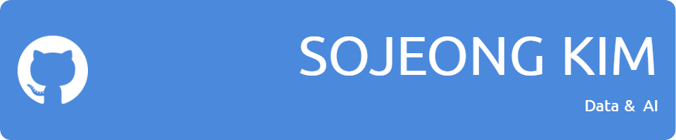

  

###  🛠️ Skills  

<!-- 프로그래밍 언어 -->

<!-- 프론트엔드 -->

 

<!-- 데이터베이스 -->

<!-- 머신러닝/딥러닝 -->

<!-- 운영체제 및 자동화 -->

 

<!-- 버전 관리 및 협업 -->

 
 
 

  
### 🌎 I’m Excited About
**Data & Artificial Intelligence**  
Multi-modal AI and Generative Modeling
 
 
 

### 🏃‍➡️ Experiences 

  
- **2020.03 -**  : Data Science, Sejong University (SJU)  
- **2022.09 - 2022.12**  :  SAI(Sejong Artificial Intelligence & Machine Learning, 세종대 인공지능 동아리)
- **2022.11 - 2023.01**  : Cell Dynamics Laboratory @ SJU (Undergraduate Research Intern)
- **2023.06 - 2023.08** : 데이터 청년 캠퍼스 자연어처리 2023
    - YOLO와 문장 생성 모델을 이용한 반려동물 식단 관리 서비스
- **2024.03 - 2024.10** : [이상치 예측을 통한 집중호우 예측(Weather Forecasting)](https://github.com/Soojeoong/Anomaly-Forecast) 
  - **2024.06** 세종대 AI+DS 창의설계경진대회 : 레이더 이미지를 활용한 이상치 예측을 통한 집중호우 예측 🏆
  - **2024.10** 세종대 창의학기제 우수성과사례 발표대회 : 레이더 데이터와 mixture of experts를 통한 이상치 예측(후속 연구) 🥉
- **2024.03 - 2024.08** : FNAI(Food & Nutrition Artificial Intelligence Laboratory) Lab @ SJU (Undergraduate Research Intern)
- **2024.08 - 2025.02** : NAVER BoostCamp 7th (Computer Vision Track) 
  - **2024.09**: [ImageNet Sketch 이미지 분류](https://github.com/Soojeoong/level1-imageclassification-cv-07)  
  - **2024.10**: [재활용 품목 분류를 위한 Object Detection](https://github.com/Soojeoong/level2-objectdetection-cv-07)  (3위)
  - **2024.10 - 2024.11**: [다국어 영수증 OCR](https://github.com/Soojeoong/level2-cv-datacentric-cv-07)  (4위)
  - **2024.11**: [Hand Bone Image Segmentation](https://github.com/Soojeoong/level2-cv-semanticsegmentation-cv-02-lv3) (7위)

      

<!--

- 🔭 I’m currently working on ...
- 🌱 I’m currently learning ...
- 👯 I’m looking to collaborate on ...
- 🤔 I’m looking for help with ...
- 💬 Ask me about ...
- 📫 How to reach me: ...
- 😄 Pronouns: ...
- ⚡ Fun fact: ...
-->
<!--  -->
<!--

-->
<!--  -->
